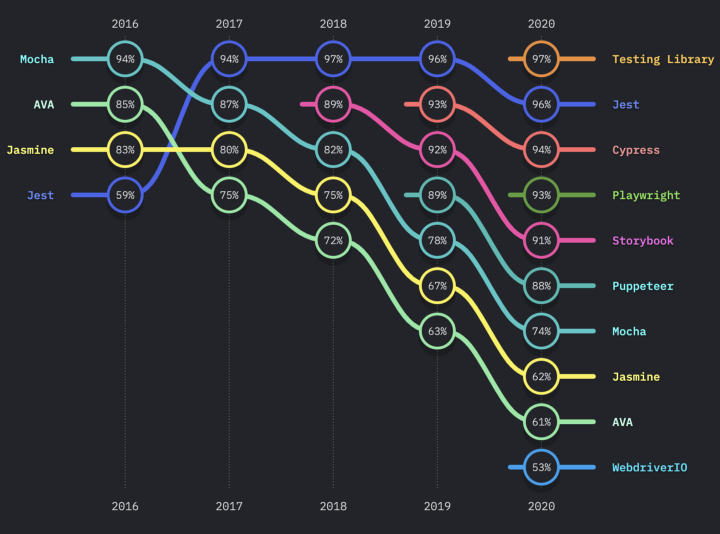
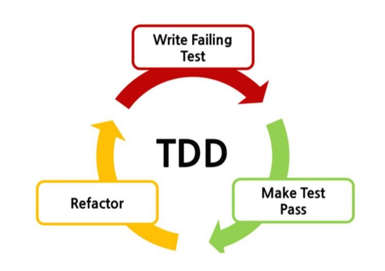
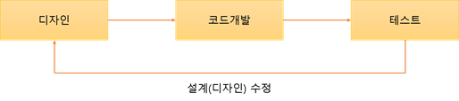
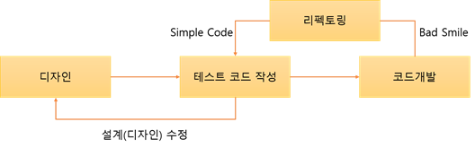

# JEST

[1. JEST](#JEST)<p>
[2. TDD](#TDD)<p>
[3. Jest docs](#Jest-docs)

## JEST


페이스북에서 만든 자바스크립트 테스팅 프레임워크

- Babel, TypeScript, Node, React, Angular, Vue와 사용 가능하다
- Jest를 활용하면 프론트엔드 뿐만 아니라 Node.js 환경에 구축된 백엔드 애플리케이션도 테스트할 수 있다.
- 설치가 쉽고 빠르다
- Jest는 다양한 API를 제공
  - Assertion, Mocking, Snapshot, Spy library, Code coverage ...



(2016 ~ 2020) jest 사용률은 1~2위에 위치해있다.

## TDD

Test Driven Development `테스트 주도 개발`<br>
반복 테스트를 통한 소프트웨어 방법론으로, 우선 테스트를 작성하고 이를 통과하는 코드를 추가하는 단계를 반복하여 구현한다.

### TDD 디자인, 기술적 관점에 따른 목표

디자인 관점 - 검증이 아닌 명세를 목표.
즉, TDD 자체가 요구 사항이자 디자인으로 생각한다.<br>
기술적 관점 - 작동하는 깨끗한 코드 ‘Clean code that works’ 작성<br>

TDD는 일반적인 개발 프로세스의 고질적인 문제점들을 고안해서 나온 개발 방법론이다.


### TDD 개발 주기

- [Red 단계] 실패하는 테스트 코드를 먼저 작성한다.
- [Green 단계] 테스트 코드를 성공시키기 위한 실제 코드를 작성한다.
- [Yellow 단계] 중복 코드 제거, 일반화 등의 리팩토링을 수행한다.
- 중요점
  - 실패하는 테스트 코드를 작성할 때까지 실제 코드 작성하지 않는 것
  - 실패하는 테스트를 통과할 정도의 최소 실제 코드를 작성해야 함<br>
    => 실제 코드의 기대점을 정확하고 명확하게 정의함으로 불필요한 설계를 피하는 과정

### 일반 개발 방식과 TDD 개발 방식의 비교

### 일반 개발 방식

`요구사항 분석 -> 설계 -> 개발 -> 테스트 -> 배포`



이러한 방식은

1. 처음부터 완벽한 설계는 어렵다.
   > 고객 요구 사항, 디자인의 오류 등등<br>
   > 재설계로 인해 개발자는 코드를 삽입, 수정, 삭제하는 과정에서 불필요한 코드가 남거나 중복 처리 될 가능성이 크다.<p>
   > 결론적으로, **이러한 코드들은 재사용이 어렵고 관리가 어려워져 유지보수를 어렵게 만든다.**
2. 자체 버그 검출 능력 저하
3. 소스 코드의 품질 저하
4. 자체 테스트 비용 증가

### TDD 개발 방식

`테스트 코드를 작성한 뒤에 코드 개발`



1. `디자인 단계에서`<br>
   프로그래밍 목적을 반드시 미리 정의해야만 하고, 무엇을 테스트해야 할지 미리 정의해야 한다.<br>
2. `테스트 코드 작성`<br>
   작성 도중에 발생하는 예외 사항(버그, 수정사항)들을 테스트 케이스에 추가하고 설계를 개선한다.<br>
   이후 테스트가 통과된 코드만들 코드 작성 단계에서 실제 코드를 작성한다.
   > **이러한 반복적인 단계가 진행되면서 자연스럽게 코드의 버그가 줄어들고, 소스 코드는 간결해진다.**<br>또한, 테스트 케이스 작성으로 인해 자연스럽게 설계가 개선됨으로 재설계 시간이 절감된다.

### TDD 개발 방식의 장단점

### 장점

[단위 테스트]

- 동작하는 코드에 자신감을 가질 수 있다.
- 회귀 테스트를 통하여 자유롭게 리팩토링 할 수 있다.
- 코드에 대한 지식이 증가한다.
- 디버깅 시간이 현저히 줄어들 뿐만 아니라, 잘못된 코드에 대해 빠른 오류 확인이 가능하다

[테스트 코드]

- 실제 코드에 대한 이해를 높일 수 있다.
- 실제 코드에 좋지 않은 설계 구조를 손쉽게 파악할 수 있다.
- 테스트 코드 작성 단계에서 실제 코드에 대한 명확한 처리를 설계함으로써 과도한 설계를 피할 수 있고, 간결한 인터페이스를 갖는다.

### 단점

- 생산성의 저하
  - 테스트 코드 -> 코드 개발 과정을 거쳐 2개의 코드를 작성해야하고 중간중간 테스트를 하면서 고쳐나가야하기 때문에 개발 속도가 느려진다는 사람이 많다.
  - TDD의 개발 시간은 일반적인 개발 방식에 비해 대략 10~30% 정도로 늘어난다.
- 익숙하지 않다.
  - 이제껏 자신이 개발하던 방식을 많이 바꿔야 한다.
  - 오히려 개발을 별로 해보지 않은 사람들이 더 적용하기 쉬움

## Jest docs

### Getting Started

```
yarn add --dev jest
```

sum.js 파일안에 만든 sum 함수를 테스트 해볼 수 있다.

```js
function sum(a, b) {
  return a + b;
}
module.exports = sum;
```

sum.test.js 파일에 함수를 불러와서 테스트 할 수 있다.

```js
const sum = require("./sum");

test("1 더하기 2의 값은 3이다", () => {
  expect(sum(1, 2)).toBe(3);
});
```

package.json 안에 scripts를 넣어야
yarn test를 터미널에 실행시킬 수 있다.

```js
{
  "scripts": {
    "test": "jest"
  }
}
```

### Using Matchers

- 기본적으로 `expect().toBe()`를 사용해서 예상값과 정답을 테스트해봄

```js
const sum = require("./sum");

test("1 더하기 2는 4", () => {
  expect(2 + 2).toBe(4);
});

test("1 더하기 2는 4", () => {
  expect(sum(2, 2)).toBe(4);
});

test("1 더하기 2는 5", () => {
  expect(sum(2, 2)).not.toBe(5);
});
```

- `toEqual()`은 깊은 비교에 쓰이며 주로 객체와 같은지를 확인한다.
- 객체가 같더라도 서로 다른 메모리에 있기 때문에 toBe를 쓰면 false로 나온다.

```js
// 객체 비교
test("data에 담긴 객체가 { one: 1, two: 2 }와 같다.", () => {
  const data = { one: 1 };
  data["two"] = 2;
  expect(data).toEqual({ one: 1, two: 2 });
});
```

- `toBeNull()` `toBeDefined()` `toBeFalsy()`
- null, undefined, false 구분

```js
test("null", () => {
  const n = null;
  expect(n).toBeNull();
  expect(n).toBeDefined();
  expect(n).toBeFalsy();
});

test("zero", () => {
  const z = 0;
  expect(z).toBeDefined();
  expect(z).toBeFalsy();
});
```

- `toBeCloseTo()`
- js에서 0.1 + 0.2의 값은 0.300000004로 나온다.

```js
test("소수점 숫자 더하기", () => {
  const value = 0.1 + 0.2;
  //expect(value).toBe(0.3);
  expect(value).toBeCloseTo(0.3);
});
```

- `toMatch()`
- 정규식을 통해 해당 문자열이 위치하는지 확인하는 함수

```js
test("Christoph에서 해당 문자열이 위치했는지 알 수 있음", () => {
  expect("Christoph").toMatch(/stop/);
});
```

- `toContain()`
- 배열에서 특정 요소가 위치하는지 확인할 수 있는 함수

```js
const shoppingList = ["diapers", "kleenex", "milk"];

test("쇼핑 리스트에 milk가 포함되어있는지", () => {
  expect(shoppingList).toContain("milk");
});
```

### Asynchronous Code

- callback을 써서 비동기 작업을 할 수 있다.

```js
const getName = (callback) => {
  const name = "Mike";
  setTimeout(() => {
    callback(name);
  }, 3000);
};

// 올바르지 않은 예
test("3초 후에 받아온 이름은 Mike", () => {
  function callback(name) {
    expect(name).toBe("Mike");
  }
  getName(callback);
});
// 올바른 예
test("3초 후에 받아온 이름은 Mike", (done) => {
  function callback(name) {
    expect(name).toBe("Mike");
    done();
  }
  getName(callback);
});
```

- 프로미스

```js
const getAge = () => {
  const age = 30;
  return new Promise((res, rej) => {
    setTimeout(() => {
      res(age);
    }, 2000);
  });
};

test("2초후에 받아온 나이는 30", () => {
  getAge().then((age) => {
    expect(age).toBe(30);
  });
});

test("", () => {
  return expect(getAge()).resolves.toBe(30);
});
```

- async await

```js
test("2초 후 30", async () => {
  await expect(getAge()).resolves.toBe(30);
});
```

### 테스트 전 후 작업

- afterEach, beforeEach
- 작업 전, 후에 해당 변수값을 변경함

```js
let num = 10;

afterEach(() => {
  num = 0;
});
test("0더하기 1은 1이야", () => {
  num = sum(num, 1);
  expect(num).toBe(1);
});
test("0더하기 2은 2이야", () => {
  num = sum(num, 2);
  expect(num).toBe(2);
});
test("0더하기 3은 3이야", () => {
  num = sum(num, 3);
  expect(num).toBe(3);
});
test.skip("0더하기 4은 4이야", () => {
  num = sum(num, 4);
  expect(num).toBe(4);
  num = 10;
});
```

### mock

- `jest.fn()`를 통해 mock함수를 만들 수 있다.

```js
const mockFn = jest.fn();
mockFn();
mockFn(1);
// 함수가 몇번 호출되었는가 함수가 적용될 때 들어간 인수

test("dd", () => {
  console.log(mockFn.mock.calls);
});
test("함수는 2번 호출됩니다.", () => {
  expect(mockFn.mock.calls.length).toBe(2);
});
test("2번째로 호출된 함수에 전달된 인수는 1이다.", () => {
  expect(mockFn.mock.calls[1][0]).toBe(1);
});
```

```js
const mockFn = jest.fn();

const forEachadd1 = (arr) => {
  arr.forEach((num) => {
    mockFn(num + 1);
  });
};

forEachadd1([10, 20, 30]);

test("함수 호출은 3번 됩니다.", () => {
  expect(mockFn.mock.calls.length).toBe(3);
});
test("전달된 값은 11, 22, 33", () => {
  expect(mockFn.mock.calls[0][0]).toBe(11);
  expect(mockFn.mock.calls[1][0]).toBe(21);
  expect(mockFn.mock.calls[2][0]).toBe(31);
});
```

```js
const mockFn = jest.fn((num) => num + 1);

mockFn(10);
mockFn(20);
mockFn(30);

test("전달된 값은 11, 22, 33", () => {
  console.log(mockFn.mock.results);
  expect(mockFn.mock.results[0].value).toBe(11);
  expect(mockFn.mock.results[1].value).toBe(21);
  expect(mockFn.mock.results[2].value).toBe(31);
});
```

```js
const mockFn = jest.fn();

mockFn
  .mockReturnValueOnce(10)
  .mockReturnValueOnce(20)
  .mockReturnValueOnce(30)
  .mockReturnValue(40);

mockFn();
mockFn();
mockFn();
mockFn();

test("mock함수의 결과값을 보자", () => {
  console.log(mockFn.mock.results);
});
```
